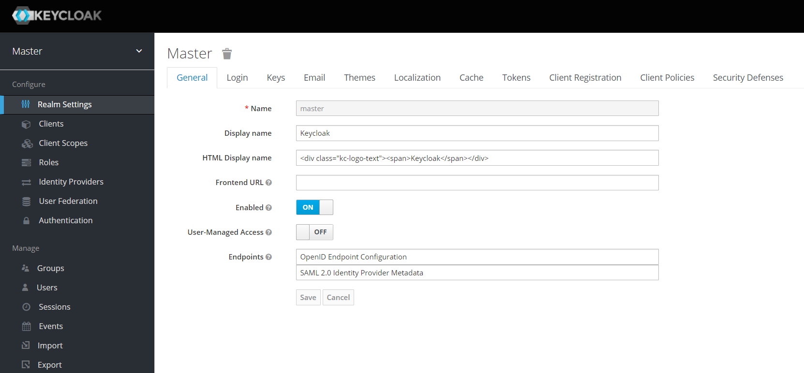
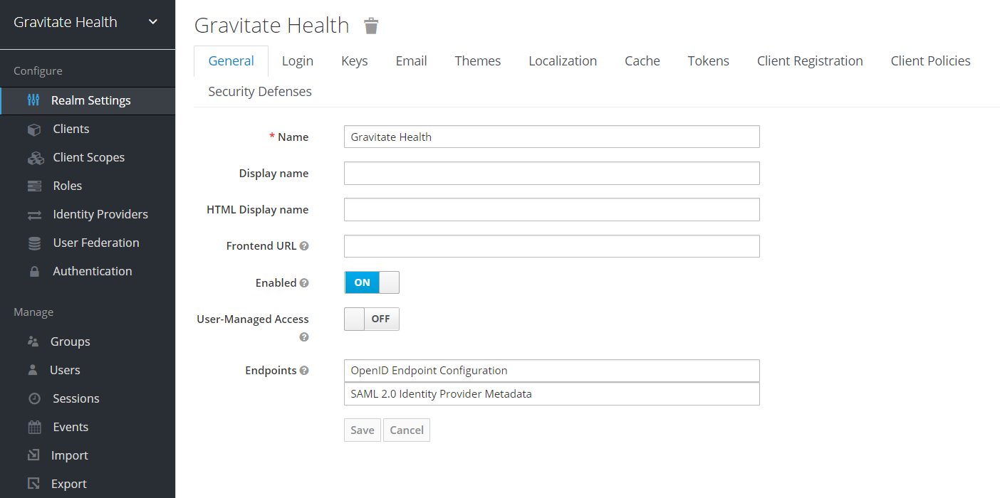

Keycloak
=================================================

[](https://opensource.org/licenses/Apache)


Table of contents
-----------------
- [Keycloak](#keycloak)
  - [Table of contents](#table-of-contents)
  - [Introduction](#introduction)
  - [Installation](#installation)
    - [Requirements](#requirements)
    - [Local deployment](#local-deployment)
    - [Kubernetes deployment](#kubernetes-deployment)
  - [Usage](#usage)
  - [Known issues and limitations](#known-issues-and-limitations)
  - [Getting help](#getting-help)
  - [Contributing](#contributing)
  - [License](#license)
  - [Authors and history](#authors-and-history)
  - [Acknowledgments](#acknowledgments)

Introduction
------------
Keycloak is an Open Source Identity and Access Management application. This tool provides the security adding authentications to the applications with a easy mechanism. It is not an application for dealing with storing users or their authentications. Users authenticate with Keycloak rather than individual applications. Once logged-in to Keycloak, users don't have to login again to access a different application.

Installation
------------
### Requirements
To deploy keycloak is necessary to have installed previously JAVA 11 JRE. 

### Local deployment
First of all, we need to install our server in the [Keycloak Download](https://www.keycloak.org/documentation) to set it up locally. There are different options to do it, but in this deployment it will be choose the _.zip_ format. 

When the _.zip_ is downloaded, it is necessary to extract the content. We open the folder extracted and open a terminal with the following command:

```bash
 cd path/keycloak-18.0.0/keycloak-18.0.0/bin
```
Once this is done, we are going to start the server, to access to the keycloak interface. 

```bash
.\kc.bat start-dev
```
This command will respond with the localhost URL where is runnig our server, as follows http://127.0.0.x:8080. If we access with a browser, the keycloak interface will welcome us. In the first access is necessary to create an account by adding a username/email and a password. Once authenticated, the configuration interface of keycloak appears at the Master Realm.

A **Realm** is an object that manage a set of of users, credentials, roles, and groups. A user in Keycloak belongs to only one realm and the user who logs in to Keycloak will log into that user's realm. The Master Realm contains the administrator account.



### Kubernetes deployment

The Kubernetes deployment uses the public Keycloak image hosted at [quay.io](https://quay.io/repository/keycloak/keycloak). And the public Postgresql image hosted at [hub.docker](https://hub.docker.com/_/postgres), which will be used as persistence. The files for the deployment can be found at the [YAMLs](YAMLs/) directory

Both the deployment files for the Postgres DB and the Keycloak contain several environment variables which can be modified. These environmnet variables are the ones we used but the configuration allows for much more. Furthermore, the file [001_keycloak-secrets.yaml](YAMLs/001_keycloak-secrets.yaml) contains the values for the passwords to be used in the deployment files, you must generate your own and convert it into base64 and replace it. For example:

```bash
echo -n Mypassword1234! | base64 -w 0     # Make sure there is no trailing "\n", it will fail
```

- Postgres environment variables

| Environment Variable | description                                   | default                         |
|----------------------|-----------------------------------------------|---------------------------------|
| POSTGRES_DB          | Database name to be created on initialization | keycloak                        |
| POSGRES_PASSWORD     | Database password                             | \<secret>                       |
| POSTGRES_USER        | Database user                                 | keycloak                        |
| PGDATA               | Data location                                 | /var/lib/postgresql/data/pgdata |

- Keycloak environment variables

| Environment Variable    | description                                                                                                   | default                                      |
|-------------------------|---------------------------------------------------------------------------------------------------------------|----------------------------------------------|
| KEYCLOAK_ADMIN          | Username of the Keycloak admin user                                                                           | admin                                        |
| KECYLOAK_ADMIN_PASSWORD | Password of the Keycloak admin user                                                                           | \<secret>                                    |
| KC_DB_PASSWORD          | Password of the Postgres DB                                                                                   | \<secret>                                    |
| KC_DB_USERNAME          | Username of the database user                                                                                 | keycloak                                     |
| KC_PROXY                | Type of proxy to be used                                                                                      | edge                                         |
| KC_DB_URL               | Full connection URL to the database                                                                           | jdbc:postgresql://keycloak-postgres/keycloak |
| KC_HOSTNAME_STRICT      | Allow other hostnames to be used, required "false" for use with a reverse proxy without further configuration | false                                        |
| KC_HTTP_ENABLED         | If HTTP can be used                                                                                           | true                                         |
| KC_DB_SCHEMA            | Schema of the database                                                                                        | public                                       |
| KC_LOG_LEVEL            | Log level                                                                                                     | debug                                        |

The next step is to apply the Kubernetes files in the cluster, the services will be deployed in the development namespace. In case the namespace has not been created before you can create it with the following commands, or change the name in `metadata.namespace`:

First we deploy the database:

```bash
kubectl create namespace <namespace>                         # Only if namespace not created and/or the current context
kubectl config set-context --current --namespace=<namespace> # Only if namespace not created and/or the current context

kubectl apply -f YAMLs/001_keycloak-secrets.yaml
kubectl apply -f YAMLs/002_postgres_pvc.yaml
kubectl apply -f YAMLs/003_postgres_service.yaml
kubectl apply -f YAMLs/004_postgres_deployment.yaml
```

Once the database is ready the Keycloak can be deployed, you can check if the database is ready by running:

```bash
kubectl get pod | grep "keycloak-postgres"
```
```bash
NAMESPACE            NAME                                         READY   STATUS    RESTARTS        AGE
<namespace>          keycloak-postgres-6cc76fc8dc-fbtqv           1/1     Running   0               10d
```

If the status is running proceed with the Keycloak deployment:

```bash
kubectl apply -f YAMLs/005_keycloak_service.yaml
kubectl apply -f YAMLs/006_keycloak_deployment.yaml
```

You can check if the deployment is ready by running:

```bash
kubectl get pod | grep "keycloak"
```
```bash
NAMESPACE            NAME                                         READY   STATUS    RESTARTS        AGE
<namespace>          keycloak-54d87cb874-fgfqt                    1/1     Running   0               12d
```

If the pod is ready you can access the service by other services in the same namespace by using the name of its Kubernetes service and the port (especified in [005_keycloak_service.yaml](YAMLs/005_keycloak-service.yaml)). You can also obtain both by running the following commands:

```bash
kubectl get svc | grep "keycloak"
```
```bash
NAME                       TYPE        CLUSTER-IP       EXTERNAL-IP   PORT(S)             AGE
keycloak                   ClusterIP   10.152.183.207   <none>        8080/TCP            48d
```

The type of the service is _ClusterIP_ which means that the service can only be accessed from inside the cluster. Moreover, if the Kubernetes cluster has a DNS manager other services can access services in other namespaces using the following URL: ```http://<service-name>.<namespace>.svc.cluster.local```. To learn more about the types of services and its uses in Kubernetes, here is the [official documentation](https://kubernetes.io/docs/concepts/services-networking/). Alternatively if the [Gateway](https://github.com/Gravitate-Health/Gateway) has been deployed, the service will be proxied to the outside of the cluster at `https://<DNS>/`.

Usage
-----
Now, we need to create our own **Realm** for the project. Therefore, in the left corner where is indicated 'Master', click in _Add Realm_ an create one. As it can been seen at the top there are some tabs, to continue with the configuration. 



- The _Login_ tab. Configuration options for login as _forgot password_, _remember me_, _require SSL_, etc.
- The _Keys_ tab. Configuration the cryptographic signatures for the authentication protiocols. 
- The _Email_ tab. Keycloak sends emails to users to verify their email addresses, when they forget their passwords, or when an administrator needs to receive notifications about a server event. Therefore, this configure the SMTP server settings. 
- The _Themes_ tab. Cofiguration for change the appearance of any UI, including the language that appears.
- The _Cache_ tab. Keycloak caches everything it can in memory, through this tab you can clean it. 
- The _Localization_ tab. Localizations configured for the Realm.
- The _Tokens_ tab. Configuration to create the tokens with an specific algotithm and times. 
- The _Client Registration_ tab. Configuration of the requesites that a client must comply to be registered. 
- The _Client Policies_ tab. Policies for the validation of Client configurations Registration
- The _Securitues Defenses_ tab. As the name suggests, defenses against possible security attacks: brute force, XSS, etc.  

At the same time, in the left side exist other tabs for _Configure_: 

- Clients. Clients are applications that can request authentication of a user. 
- Clients Scope. Configuration protocol mappers and role scope mappings for multiple clients.
- Roles. Configuration to define specific applications permissions and access control.
- Identity Providers. Derivation from a specific protocol used to authenticate and send authentication and authorization information to users. 
- User Federation. Keycloak can store and manage users. It can be configured to validate credentials from LDAP or Active Directory services.
- Authetication. Configuration of a flow authentication container for the log in, registration, and other Keycloak workflows. 
  
Also in the lower left side, it is a section for _Manage_ where it can be defined Groups of users, Users, Sessions or Events. Finally, it can be Export the configuration defined in a json document and Import in other Keycloak Server.

For more information of any of these concepts go to the Acknowledgments links. 

Known issues and limitations
----------------------------

Getting help
------------
In case you find a problem or you need extra help, please use the issues tab to report the issue.

Contributing
------------
To contribute, fork this repository and send a pull request with the changes squashed.

License
------------

This project is distributed under the terms of the [Apache License, Version 2.0 (AL2)](https://www.apache.org/licenses/LICENSE-2.0). The license applies to this file and other files in the [GitHub repository](https://github.com/Gravitate-Health/keycloak) hosting this file.
```
Copyright 2022 Universidad Politécnica de Madrid

Licensed under the Apache License, Version 2.0 (the "License");
you may not use this file except in compliance with the License.
You may obtain a copy of the License at

    http://www.apache.org/licenses/LICENSE-2.0

Unless required by applicable law or agreed to in writing, software
distributed under the License is distributed on an "AS IS" BASIS,
WITHOUT WARRANTIES OR CONDITIONS OF ANY KIND, either express or implied.
See the License for the specific language governing permissions and
limitations under the License.
```

Authors and history
---------------------------
- Isabel Varona ([@isabelvato](https://github.com/isabelvato))
- Álvaro Belmar ([@abelmarm](https://github.com/abelmarm))

Acknowledgments
---------------------------
- [Keycloak Documentation](https://www.keycloak.org/documentation)
- [Keycloak Getting Started](https://www.keycloak.org/getting-started/getting-started-zip)
- [Keycloak Server Administration Guide](https://www.keycloak.org/docs/latest/server_admin/)

