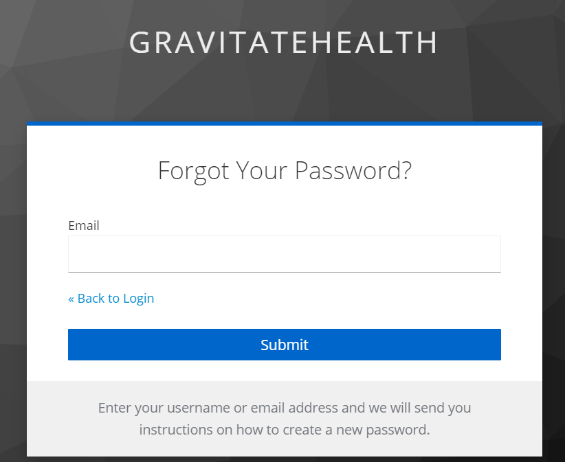

Keycloak
=================================================

[](https://opensource.org/licenses/Apache)


Table of contents
-----------------
- [Keycloak](#keycloak)
  - [Table of contents](#table-of-contents)
  - [Introduction](#introduction)
  - [Installation](#installation)
    - [Deployment](#deployment)
  - [Usage](#usage)
    - [Example operation](#example-operation)
      - [**Login**](#login)
      - [**Registration of Users**](#registration-of-users)
      - [**Sign-Out**](#sign-out)
      - [**Log-Out**](#log-out)
      - [**Reset Credentials**](#reset-credentials)
  - [Known issues and limitations](#known-issues-and-limitations)
  - [Getting help](#getting-help)
  - [Contributing](#contributing)
  - [License](#license)
  - [Authors and history](#authors-and-history)
  - [Acknowledgments](#acknowledgments)

Introduction
------------
Keycloak is an Open Source Identity and Access Management application. This tool provides the security adding authentications to the applications with a easy mechanism. It is not an application for dealing with storing users or their authentications. Users authenticate with Keycloak rather than individual applications. Once logged-in to Keycloak, users don't have to login again to access a different application.

Installation
------------

### Deployment

Refer to the [General FOSPS Deployment Documentation](https://github.com/Gravitate-Health/Documentation) to deploy this service.


Usage
-----
Now, we need to create our own **Realm** for the project. Therefore, in the left corner where is indicated 'Master', click in _Add Realm_ an create one. As it can been seen at the top there are some tabs, to continue with the configuration. 


- The _Login_ tab. Configuration options for login as _forgot password_, _remember me_, _require SSL_, etc.
- The _Keys_ tab. Configuration the cryptographic signatures for the authentication protiocols. 
- The _Email_ tab. Keycloak sends emails to users to verify their email addresses, when they forget their passwords, or when an administrator needs to receive notifications about a server event. Therefore, this configure the SMTP server settings. 
- The _Themes_ tab. Cofiguration for change the appearance of any UI, including the language that appears.
- The _Cache_ tab. Keycloak caches everything it can in memory, through this tab you can clean it. 
- The _Localization_ tab. Localizations configured for the Realm.
- The _Tokens_ tab. Configuration to create the tokens with an specific algotithm and times. 
- The _Client Registration_ tab. Configuration of the requesites that a client must comply to be registered. 
- The _Client Policies_ tab. Policies for the validation of Client configurations Registration
- The _Securitues Defenses_ tab. As the name suggests, defenses against possible security attacks: brute force, XSS, etc.  

At the same time, in the left side exist other tabs for _Configure_: 

- Clients. Clients are applications that can request authentication of a user. 
- Clients Scope. Configuration protocol mappers and role scope mappings for multiple clients.
- Roles. Configuration to define specific applications permissions and access control.
- Identity Providers. Derivation from a specific protocol used to authenticate and send authentication and authorization information to users. 
- User Federation. Keycloak can store and manage users. It can be configured to validate credentials from LDAP or Active Directory services.
- Authetication. Configuration of a flow authentication container for the log in, registration, and other Keycloak workflows. 
  
Also in the lower left side, it is a section for _Manage_ where it can be defined Groups of users, Users, Sessions or Events. Finally, it can be Export the configuration defined in a json document and Import in other Keycloak Server.

For more information of any of these concepts go to the Acknowledgments links. 

### Example operation
Following are some examples of the requests that can be made to the Keycloak authentication API. 

#### **Login**
Making a POST request to the **token endpoint** of Keycloak. 

```bash
curl --location --request POST 'https://<url>/realms/GravitateHealth/protocol/openid-connect/token' \
--header 'Content-Type: application/x-www-form-urlencoded' \
--data-urlencode 'client_id=GravitateHealth' \
--data-urlencode 'grant_type=password' \
--data-urlencode 'username=myuser' \
--data-urlencode 'password=mypassword'
```
This command does  the following:

- Providing the **Content-Type** header as _application/x-www-form-urlencoded_.
- Encoding the request body data as URL parameters.
- The **grant_type** is set to password to indicate that this is a password grant request.
- **client_id** is the credentials of the client that is trying to authenticate.
- **username** and **password** are the credentials of the user that is trying to authenticate.

When the command is successfully executed, the response will contain a JSON payload with the access token and other information, like token type and expiry time. The response should look like this:

```JSON
{
    "access_token": "<TOKEN>",
    "expires_in": 300,
    "refresh_expires_in": 1800,
    "refresh_token": "<REFRESH_TOKEN>",
    "token_type": "Bearer",
    "not-before-policy": 0,
    "session_state": "48b9d271-2858-47bc-b6b8-a36e5afe9d0c",
    "scope": "email profile"
}
```

#### **Registration of Users**

_This request requires access to a service account, which allows applications to access a set of endpoints used to manage a user's account. This action will be performed upon explicit request to WP3 or to the system administrators._

Adding users to the existing list. Making a POST request to the **users endpoint** of Keycloak.

```bash
curl --location --request POST 'http://gravitate-health.lst.tfo.upm.es/admin/realms/GravitateHealth/users' \
--header 'Content-Type: application/json' \
--header 'Authorization: Bearer $ACCESS_TOKEN' \
--data-raw '{
  "username": "jdoe",
  "email": "jdoe@example.com",
  "firstName": "John",
  "lastName": "Doe",
  "enabled": true,
  "credentials": [
    {
      "type": "password",
      "value": "password",
      "temporary": false
    }
  ]
}'
```
_In this case the JSON in the data-raw section is an example of a possible user._

This command does the following:
- Providing the **Content-Type** header as application/json.
- The **Authorization header** that includes the **access token** obtained from the token endpoint.
- The user details in the body of the request are being passed as JSON object:
  - **username**: specify a unique username.
  - **email**: specify a email.
  - **firstName** : specify the first name.
  - **lastName** : specify the last name.
  - **enabled** : set to true.

When you receive a _20X_ response, it will register/create a new user in keycloak, and return a response with the user's details.

#### **Sign-Out**
The process to sign out is related to the access token (as the login process). An Access Token is a data structure that has a lifetime encapsulated in it. So it is supposed to be valid until that time ends, so you cannot revoke an access token directly. Even though, you must set a short lifetime into the access token to avoid possible compromises. 

#### **Log-Out**

Making a POST request to the **logout endpoint** of Keycloak.

```bash
curl --location --request POST 'https://gravitate-health.lst.tfo.upm.es/realms/GravitateHealth/protocol/openid-connect/logout' \
--header 'Authorization: Bearer $ACCESS_TOKEN' \
--header 'Content-Type: application/x-www-form-urlencoded' \
--data-urlencode 'client_id=GravitateHealth' \
--data-urlencode 'refresh_token= $REFRESH_TOKEN' \
```

This command does the following:

- Providing the **Authorization header** that includes the access token of the user you want to log out.
- Providing the **Content-Type** header as _application/x-www-form-urlencoded_.
- The **client_id** is the id of the client that the user is logged in with.
- **Refresh_token** is the refresh token of the user that you want to revoke.

The result is that the access token and the refresh token will expire, and the user will be logged out.

#### **Reset Credentials**
_This request requires access to a service account, which allows applications to access a set of endpoints used to manage a user's account. This action will be performed upon explicit request to WP3 or to the system administrators._

1. First of all, you need to obtain the id of the user you want to reset the credentials. Making a GET request to the **/users endpoint** of Keycloak.

```bash
curl --location --request GET 'https://gravitate-health.lst.tfo.upm.es/admin/realms/GravitateHealth/users?username={{username}}' \
--header 'Authorization: Bearer $ACCESS_TOKEN' \
```
This command is doing the following:

- Providing the **Authorization header** that includes the access token obtained from the token endpoint.
- In the query param, the **username** is being passed, the email address can be passed as well. 

When the command is executed, the response will be a list of all the users with that username, in the response, you can find the **id** of that user. You can also use other attributes like email, firstName, lastName to search a user and obtain the id.

2. The second action is to reset the password. Making a PUT request to the **_/users/{id}/execute-actions-email_ endpoint** of Keycloak.
   
```bash
curl --location --request PUT 'http://gravitate-health.lst.tfo.upm.es/admin/realms/GravitateHealth/users/{{user-id}}/execute-actions-email' \
--header 'Content-Type: application/json' \
--header 'Authorization: Bearer $ACCESS_TOKEN' \
```

This command is doing the following:

- Providing the **Content-Type** header as _application/json_.
- The **Authorization header** that includes the access token obtained from the token endpoint.
- The **_user-id_** in the url should be replaced with actual user-id

When the command is executed, the server will initiate the password reset flow and send an email to the user with a link that they can use to reset their password. In this case the user is forced to reset the credentials.

Besides, the credentials reset process can be performed by the Keycloak's automatic system which has been configured already with the _'Forget Password'_ bottom in the _Login Page_ as it can be seen in the image below. 



Known issues and limitations
----------------------------

There is no persistence to the APIs added at runtime, meaning that if the pod were to restart those changes will be lost.


Getting help
------------
In case you find a problem or you need extra help, please use the issues tab to report the issue.

Contributing
------------
To contribute, fork this repository and send a pull request with the changes squashed.

License
------------

This project is distributed under the terms of the [Apache License, Version 2.0 (AL2)](https://www.apache.org/licenses/LICENSE-2.0). The license applies to this file and other files in the [GitHub repository](https://github.com/Gravitate-Health/keycloak) hosting this file.
```
Copyright 2022 Universidad Politécnica de Madrid

Licensed under the Apache License, Version 2.0 (the "License");
you may not use this file except in compliance with the License.
You may obtain a copy of the License at

    http://www.apache.org/licenses/LICENSE-2.0

Unless required by applicable law or agreed to in writing, software
distributed under the License is distributed on an "AS IS" BASIS,
WITHOUT WARRANTIES OR CONDITIONS OF ANY KIND, either express or implied.
See the License for the specific language governing permissions and
limitations under the License.
```

Authors and history
---------------------------
- Isabel Varona ([@isabelvato](https://github.com/isabelvato))
- Álvaro Belmar ([@abelmarm](https://github.com/abelmarm))

Acknowledgments
---------------------------
- [Keycloak Documentation](https://www.keycloak.org/documentation)
- [Keycloak Getting Started](https://www.keycloak.org/getting-started/getting-started-zip)
- [Keycloak Server Administration Guide](https://www.keycloak.org/docs/latest/server_admin/)
- [Keycloak Admin REST API v18.0](https://www.keycloak.org/docs-api/18.0/rest-api/index.html)

